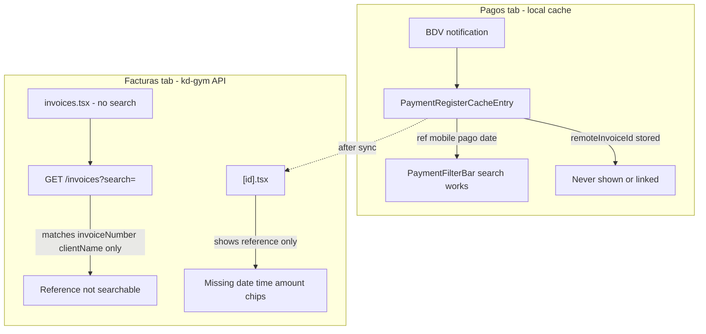

# Invoice search by pago móvil reference (full stack)

## Problem analysis

Staff need to answer: *"Which invoice matches this BDV reference?"* Today that workflow is broken across two disconnected models:



| Gap | Impact |
|-----|--------|
| Backend `search` ignores `invoice_payments.reference` | Server-side invoice lookup by ref impossible |
| [`app/(tabs)/invoices.tsx`](app/(tabs)/invoices.tsx) passes `{}` to query | No search UI despite [`InvoiceListParamsInput.search`](types/invoice/invoice.schemas.ts) |
| List cards hide payment ref | Staff cannot scan results for the ref they typed |
| [`app/invoices/[id].tsx`](app/invoices/[id].tsx) payment block is minimal | Missing date, time, amount, copy-to-clipboard, pago móvil badge |
| `remoteInvoiceId` on payment registers unused | Pagos → Factura navigation missing |
| No `mobile` on `InvoicePayment` | Emitter phone only exists on payment registers, not invoice API |

**Design principle:** One mental model — *reference is the primary key for lookup*; phone is secondary context surfaced when available from linked payment register.

---

## Target UX (2025 mobile audit patterns)

### Facturas list — search-first when staff need lookup

Mirror the proven [`PaymentFilterBar`](components/payments/PaymentFilterBar.tsx) pattern (search icon, clear button, debounce, result count) but scoped to invoices:

- Sticky search bar: placeholder `"Buscar por referencia, factura o cliente…"`
- Debounce 300ms via existing [`useDebouncedValue`](hooks/use-debounced-value.ts)
- **Reference-first highlighting**: when query looks like a ref (digits ≥8), show ref chip on matching cards
- Optional status chips (`paid`, `pending`, `all`) — reuse [`FilterChips`](components/shared/FilterChips.tsx)
- Empty states: distinguish *no invoices* vs *no results for "222917745208"*
- Pull-to-refresh preserves active search params

### Invoice detail — rich pago móvil panel

Replace the thin payment block with a dedicated **`InvoicePaymentDetailCard`** (reuse visual language from [`PaymentDetailSheet`](components/payments/PaymentDetailSheet.tsx) hero + grid):

| Field | Source |
|-------|--------|
| Amount | `invoice.payment.amount` + currency |
| Reference | `invoice.payment.reference` (mono, copy button) |
| Payment date / time | `invoice.payment.paymentDate/Time` |
| Method badge | `pago_movil` chip |
| Emitter phone | `paymentRegister.mobile` when linked (see API below) |
| Linked register CTA | "Ver en Pagos" when register exists locally |

Actions: **Copy reference**, **Share summary** (optional v2).

### Pagos cross-link

When `entry.remoteInvoiceId` is set on a [`PaymentRegisterCacheEntry`](types/payment/payment-register-cache.types.ts):

- Show `InvoiceLinkRow` in [`PaymentDetailSheet`](components/payments/PaymentDetailSheet.tsx): "Factura FAC-001" → `/invoices/{id}`
- Deep-link from invoice detail back to Pagos entry when local cache match by `remoteInvoiceId`

---

## Phase 1 — kd-gym backend (API + data)

**Repo:** kd-gym (separate from this mobile repo)

### 1.1 Extend invoice list search

Update `GET /api/v1/invoices` list handler to join `invoice_payments` and match `search` against:

- `invoices.invoice_number` (existing)
- `clients.full_name` (existing)
- **`invoice_payments.reference`** (new — partial match, strip spaces/dashes)
- Optionally **`invoice_payments.reference` exact** when query is all digits and length ≥ 8 (fast path)

SQL pattern (conceptual):

```sql
WHERE invoice_number ILIKE :q
   OR client.full_name ILIKE :q
   OR payment.reference ILIKE :qNormalized
```

Add index on `invoice_payments(reference)` if missing.

### 1.2 Enrich invoice GET response for pago móvil context

Extend `GET /api/v1/invoices/:id` (and list rows when `paymentType = pago_movil`) to optionally include:

```typescript
payment?: InvoicePayment & {
  linkedRegister?: {
    id: string;
    mobile: string | null;
    notificationKey: string | null;
  };
}
```

Join `payment_registers` where `payment_registers.invoice_id = invoices.id` (one-to-one after BDV auto-create flow).

### 1.3 Dedicated lookup endpoint (recommended for edge cases)

Add `GET /api/v1/invoices/by-payment-reference?reference=` for exact ref lookup:

- Returns single invoice or 404
- Handles duplicate refs (shouldn't happen) → 409 with list
- Permission: same as `invoices:read`

This gives mobile a fast path when staff paste a 12-digit BDV ref.

### 1.4 Tests + OpenAPI

- Service tests: ref partial match, normalized input (`2229-1774-5208`), no match, auth
- Update API docs / activity log meta if staff actions are logged on web

---

## Phase 2 — Mobile data layer

### 2.1 Types

Update [`types/payment/payment.types.ts`](types/payment/payment.types.ts):

```typescript
export interface InvoicePaymentLinkedRegister {
  id: string;
  mobile: string | null;
  notificationKey: string | null;
}

export interface InvoicePayment { /* existing */ linkedRegister?: InvoicePaymentLinkedRegister; }
```

Add [`types/invoice/invoice-search.types.ts`](types/invoice/invoice-search.types.ts):

- `InvoiceSearchMode`: `'general' | 'reference'`
- `inferInvoiceSearchMode(query: string)` — digits ≥ 8 → reference mode

### 2.2 API client

Extend [`lib/api-client/invoices/InvoiceApiService.ts`](lib/api-client/invoices/InvoiceApiService.ts):

- `list({ search, status, ... })` — already supports params; no change needed once backend ships
- `getByPaymentReference(reference: string): Promise<Invoice>` — new method for exact lookup

Normalize ref before send: strip non-digits for exact endpoint; pass raw for general search.

### 2.3 Hooks

Refactor [`hooks/use-invoices.ts`](hooks/use-invoices.ts):

- `useInvoicesInfiniteQuery(params, enabled)` — already accepts params; wire from screen
- **New** `useInvoiceReferenceLookupQuery(reference, enabled)` — uses exact endpoint when mode is reference and length ≥ 8
- Query keys in [`lib/query-keys.ts`](lib/query-keys.ts): `invoices.list(params)`, `invoices.byReference(ref)`

Debounce at screen level, not inside hook (keeps query key stable).

### 2.4 Local bridge utility

New [`lib/invoices/find-local-register-for-invoice.ts`](lib/invoices/find-local-register-for-invoice.ts):

- Given `invoiceId` or `reference`, scan payment register cache for match
- Powers Pagos ↔ Facturas navigation without extra API when offline

---

## Phase 3 — Mobile UI components

### 3.1 Extract reusable search bar

New [`components/shared/SearchBar.tsx`](components/shared/SearchBar.tsx) — extract search row from `PaymentFilterBar` (icon, input, clear). Reuse in Pagos and Facturas to avoid duplication.

### 3.2 Invoice filter header

New [`components/invoices/InvoiceFilterBar.tsx`](components/invoices/InvoiceFilterBar.tsx):

- Props: `search`, `status`, `resultCount`, `totalCount`, callbacks
- Status chips: All / Pagadas / Pendientes (maps to `InvoiceStatus` filter)
- Copy in [`constants/copy.ts`](constants/copy.ts) under `facturas.search.*`

### 3.3 Enhanced list card

Update [`InvoiceListCard`](app/(tabs)/invoices.tsx) inline or extract [`components/invoices/InvoiceListCard.tsx`](components/invoices/InvoiceListCard.tsx):

- Show pago móvil badge when `payment?.paymentType === 'pago_movil'`
- Secondary line: `Ref · 222917745208` (truncate middle for long refs)
- Highlight matching substring when searching

### 3.4 Payment detail card

New [`components/invoices/InvoicePaymentDetailCard.tsx`](components/invoices/InvoicePaymentDetailCard.tsx):

- Hero amount (mono font, primary color — match Pagos)
- Detail grid: reference, date, time, method, emitter phone
- `CopyableField` row component (press → clipboard + toast via feedback bus)
- CTA row: "Ver en Pagos" if local register found

### 3.5 Screen updates

| File | Change |
|------|--------|
| [`app/(tabs)/invoices.tsx`](app/(tabs)/invoices.tsx) | Add filter bar, wire debounced search + status to query, reference-aware empty state |
| [`app/invoices/[id].tsx`](app/invoices/[id].tsx) | Replace payment block with `InvoicePaymentDetailCard` |
| [`components/payments/PaymentDetailSheet.tsx`](components/payments/PaymentDetailSheet.tsx) | Add invoice link row when `remoteInvoiceId` present |

### 3.6 Screen hook (optional, matches Pagos pattern)

New [`hooks/use-invoices-screen.ts`](hooks/use-invoices-screen.ts) — search/status state, debounce, empty-state copy selection (keeps tab screen thin like [`use-payment-feed-screen.ts`](hooks/use-payment-feed-screen.ts)).

---

## Phase 4 — UX polish and edge cases

### Edge-case matrix

| Scenario | Behavior |
|----------|----------|
| Ref not found on server | Empty state: "No hay factura con referencia X" + hint to check Pagos tab |
| Invoice exists but no payment block | Hide payment card; list card shows no ref chip |
| Partial ref typed (< 8 digits) | General search mode; subtitle explains "Escribe más dígitos para buscar referencia" |
| Offline / API error | `FeedbackEmptyState` + retry; if local register match by ref, show banner "Encontrado en Pagos (sin conexión)" |
| Duplicate refs (409) | Show disambiguation sheet with invoice numbers |
| Cash invoice (no ref) | Search by client/number only; no ref chip on card |
| Register synced but invoice not yet pulled | Pagos link works; invoice search works after backend index |
| Reference with dashes/spaces | Normalize before API call |
| Session expired mid-search | Existing auth banner; preserve query in state |

### Feedback integration

Wire search errors through [`useAppFeedback`](hooks/use-app-feedback.ts):

- `reportError('invoice_list_fetch', ...)` with `presentationContext: { anchor: 'list' }`
- Log reference lookups to activity log (`kind: 'invoice_reference_search'`) — new optional `OperationKind` for audit trail

### Accessibility

- Search field: `accessibilityLabel`, `returnKeyType="search"`
- Copy buttons: announce "Referencia copiada"
- Ref displayed in mono for legibility (12-digit BDV refs)

---

## Phase 5 — Testing and rollout

### Mobile tests

| File | Coverage |
|------|----------|
| `__tests__/infer-invoice-search-mode.test.ts` | Reference vs general detection, normalization |
| `__tests__/find-local-register-for-invoice.test.ts` | Bridge by id and ref |
| Extend invoice list hook tests (mock API) | Debounced params in query key |
| Manual QA script | Search ref → detail shows all fields → Pagos link round-trip |

### Backend tests (kd-gym)

- List search hits payment reference
- by-payment-reference exact endpoint
- linkedRegister join on GET detail

### Rollout

1. Ship kd-gym API + index (backward compatible)
2. Ship mobile UI behind no flag (graceful degrade if exact endpoint 404 → fall back to list search)
3. Verify on production build with real BDV ref from Pagos feed

---

## File change summary

**kd-gym (backend)**
- Invoice list route — extend search SQL
- New `by-payment-reference` route
- Invoice GET — optional `linkedRegister`
- Migration/index on `invoice_payments.reference`

**Mobile (this repo)**
- [`app/(tabs)/invoices.tsx`](app/(tabs)/invoices.tsx), [`app/invoices/[id].tsx`](app/invoices/[id].tsx)
- New: `InvoiceFilterBar`, `InvoicePaymentDetailCard`, `SearchBar`, `use-invoices-screen.ts`, `find-local-register-for-invoice.ts`
- Update: [`hooks/use-invoices.ts`](hooks/use-invoices.ts), [`InvoiceApiService.ts`](lib/api-client/invoices/InvoiceApiService.ts), [`PaymentDetailSheet.tsx`](components/payments/PaymentDetailSheet.tsx), [`constants/copy.ts`](constants/copy.ts)

---

## Recommended implementation order

1. **Backend** — search + by-reference endpoint + linkedRegister (unblocks real data)
2. **Mobile data layer** — types, API client, hooks
3. **Facturas search UI** — filter bar + list card ref chips
4. **Invoice payment detail card** — full pago móvil display
5. **Pagos cross-link** — `remoteInvoiceId` navigation
6. **Tests + QA** — edge-case matrix

Estimated effort: **backend 1–2 days**, **mobile UI 2–3 days**, **QA 0.5 day**.
