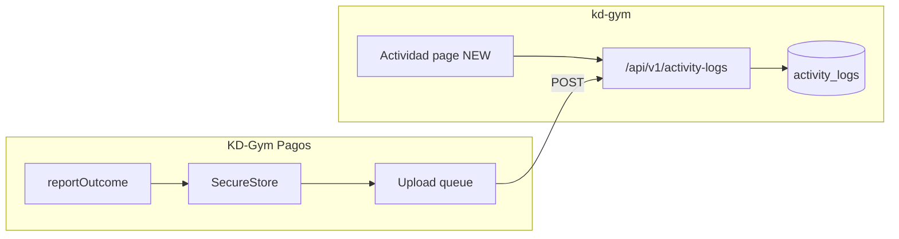
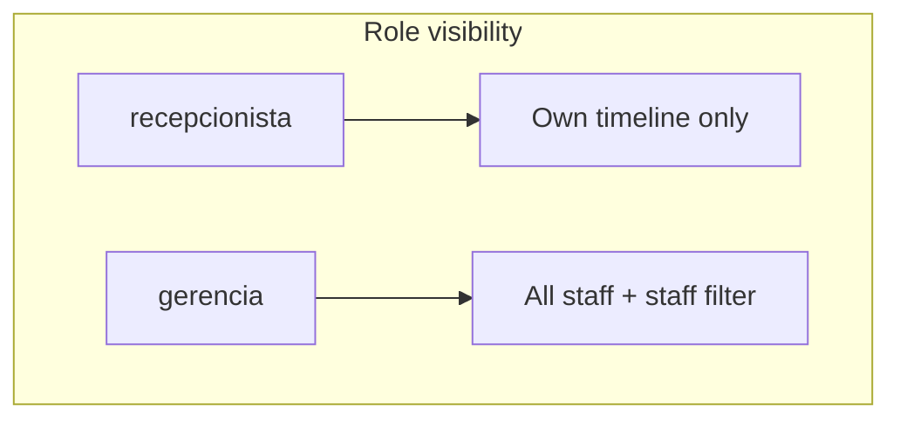

# kd-gym Activity Log Web Feature

## Current state

**Backend (done):** Migration `009_activity_logs.sql`, Drizzle schema, service, and routes at [`app/api/v1/activity-logs/route.ts`](/Users/optec-123/Desktop/Allan-Projects/kd-gym/app/api/v1/activity-logs/route.ts) and [`mine/route.ts`](/Users/optec-123/Desktop/Allan-Projects/kd-gym/app/api/v1/activity-logs/mine/route.ts). Permissions: `activity_logs:read` / `activity_logs:write` for staff roles.

**Mobile (done):** KD-Gym Pagos syncs 22 `OperationKind` values + 5 `OperationStatus` values via [`ActivityLogApiService`](/Users/optec-123/Desktop/Allan-Projects/notification-reader-kd-gym/lib/api-client/activity-log/ActivityLogApiService.ts).

**Web (missing):** No dashboard route, components, API client, hooks, or i18n. Sidebar has no Actividad entry.



---

## Design direction (2025 audit UX)

**Pattern:** Hybrid — summary KPI strip + filterable **timeline feed** (not a flat table). Audit logs are read-heavy, time-ordered, and message-rich; a timeline matches mental models from Stripe/Vercel/Railway activity views better than a dense table.

**Visual language:** Reuse kd-gym dark-first theme ([`app/globals.css`](/Users/optec-123/Desktop/Allan-Projects/kd-gym/app/globals.css)), shadcn `Card`/`Badge`/`Sheet`, Lucide status icons aligned with mobile [`OperationFeedbackCard`](/Users/optec-123/Desktop/Allan-Projects/notification-reader-kd-gym/components/feedback/OperationFeedbackCard.tsx):

| Status | Badge variant | Icon |
|--------|---------------|------|
| completed | success/green | CheckCircle |
| failed | destructive | XCircle |
| queued | warning | Clock |
| partial / skipped | secondary/muted | AlertTriangle |
| info kinds | outline | Info |

**Information hierarchy per row:**
1. **Title** (bold) — e.g. "Pago confirmado"
2. **Message** (muted, 2 lines max) — contextual detail with amount/ref
3. **Meta chips** — `Bs. 15.000`, `Cola: 2`, `3 escaneadas` parsed from `meta`
4. **Timestamp** — relative + absolute on hover (`useLocaleDate`)
5. **Kind pill** — small label: `confirm_payment` → "Confirmar pago" (Spanish i18n map)

**Detail interaction:** Row click opens a **Sheet** (not a new route) showing full message, raw `meta` JSON (collapsible), `clientEventId`, server `id`, sync timestamps. Immutable audit — no edit.

---

## Phase 1 — Web MVP (own activity, current API)

Goal: Any staff with `activity_logs:read` sees **their own** mobile-sync history on the website.

### 1.1 Web data layer

Create following existing [`ClientService`](/Users/optec-123/Desktop/Allan-Projects/kd-gym/lib/api-client/clients/ClientService.ts) + [`use-clients.ts`](/Users/optec-123/Desktop/Allan-Projects/kd-gym/hooks/use-clients.ts) patterns:

| File | Purpose |
|------|---------|
| [`lib/api-client/activity-logs/ActivityLogService.ts`](/Users/optec-123/Desktop/Allan-Projects/kd-gym/lib/api-client/activity-logs/ActivityLogService.ts) | `list({ page, limit })`, `clearMine()` |
| [`lib/query-keys.ts`](/Users/optec-123/Desktop/Allan-Projects/kd-gym/lib/query-keys.ts) | `activityLogs: { all, list(params) }` |
| [`hooks/use-activity-logs.ts`](/Users/optec-123/Desktop/Allan-Projects/kd-gym/hooks/use-activity-logs.ts) | `useActivityLogs`, `useClearActivityLogs` with sonner toasts |

### 1.2 Shared kind/status vocabulary

Add [`types/activity-log/activity-log.constants.ts`](/Users/optec-123/Desktop/Allan-Projects/kd-gym/types/activity-log/activity-log.constants.ts) mirroring mobile [`operation-outcome.types.ts`](/Users/optec-123/Desktop/Allan-Projects/notification-reader-kd-gym/types/feedback/operation-outcome.types.ts):

- `ACTIVITY_LOG_KINDS`, `ACTIVITY_LOG_STATUSES` const arrays
- `getKindLabel(kind, locale)`, `getStatusLabel(status, locale)` helpers
- Used by filters, badges, and (later) server Zod enums

### 1.3 UI components

| Component | Role |
|-----------|------|
| [`components/activity/ActivityLogsPage.tsx`](/Users/optec-123/Desktop/Allan-Projects/kd-gym/components/activity/ActivityLogsPage.tsx) | Orchestrator: KPI strip + filters + list |
| [`components/activity/ActivityLogKpiStrip.tsx`](/Users/optec-123/Desktop/Allan-Projects/kd-gym/components/activity/ActivityLogKpiStrip.tsx) | Client-side KPIs from current page/all loaded: total, failed count, last sync time |
| [`components/activity/ActivityLogFilters.tsx`](/Users/optec-123/Desktop/Allan-Projects/kd-gym/components/activity/ActivityLogFilters.tsx) | Status multi-select, kind select, date range (client-side v1), text search on title/message |
| [`components/activity/ActivityLogTimeline.tsx`](/Users/optec-123/Desktop/Allan-Projects/kd-gym/components/activity/ActivityLogTimeline.tsx) | Vertical timeline with `ActivityLogTimelineItem` |
| [`components/activity/ActivityLogDetailSheet.tsx`](/Users/optec-123/Desktop/Allan-Projects/kd-gym/components/activity/ActivityLogDetailSheet.tsx) | Full detail + meta |
| [`components/activity/ActivityLogStatusBadge.tsx`](/Users/optec-123/Desktop/Allan-Projects/kd-gym/components/activity/ActivityLogStatusBadge.tsx) | Status → color/icon |

**Page shell** (mirror [`clients/page.tsx`](/Users/optec-123/Desktop/Allan-Projects/kd-gym/app/(dashboard)/clients/page.tsx)):

- [`app/(dashboard)/activity/page.tsx`](/Users/optec-123/Desktop/Allan-Projects/kd-gym/app/(dashboard)/activity/page.tsx)
- [`app/(dashboard)/activity/loading.tsx`](/Users/optec-123/Desktop/Allan-Projects/kd-gym/app/(dashboard)/activity/loading.tsx) → `TableSkeleton` or custom timeline skeleton

**Header actions:**
- Refresh button (invalidate query)
- "Borrar historial" → `AlertDialog` → `DELETE /api/v1/activity-logs/mine` gated by `<Can permission="activity_logs:write">`

### 1.4 Navigation and RBAC

Update [`AppSidebar.tsx`](/Users/optec-123/Desktop/Allan-Projects/kd-gym/components/layout/AppSidebar.tsx):
- Nav key `activity`, icon `ScrollText` or `Activity`, href `/activity`, permission `activity_logs:read`

Update [`lib/auth/permissions.ts`](/Users/optec-123/Desktop/Allan-Projects/kd-gym/lib/auth/permissions.ts):
- `ROUTE_PERMISSIONS["/activity"] = "activity_logs:read"`
- `getRoutePermission` branch for `/activity`

### 1.5 i18n

- [`messages/es/activity-logs.json`](/Users/optec-123/Desktop/Allan-Projects/kd-gym/messages/es/activity-logs.json) — primary Spanish copy
- [`messages/en/activity-logs.json`](/Users/optec-123/Desktop/Allan-Projects/kd-gym/messages/en/activity-logs.json)
- Register in [`lib/i18n/load-messages.ts`](/Users/optec-123/Desktop/Allan-Projects/kd-gym/lib/i18n/load-messages.ts) + [`global.d.ts`](/Users/optec-123/Desktop/Allan-Projects/kd-gym/global.d.ts)
- [`messages/es/layout.json`](/Users/optec-123/Desktop/Allan-Projects/kd-gym/messages/es/layout.json): `"sidebar.activity": "Actividad"`
- Add `rolesSection.groups.activityLogs` in [`messages/es/users.json`](/Users/optec-123/Desktop/Allan-Projects/kd-gym/messages/es/users.json) for RBAC UI parity

### 1.6 Phase 1 edge cases (client-side)

| Edge case | UX |
|-----------|-----|
| Empty feed | `EmptyState`: "Sin actividad" + hint to use KD-Gym Pagos mobile |
| API error | `ErrorState` + retry |
| Loading | Timeline skeleton (3–5 placeholder cards) |
| Long message | `line-clamp-2` in list; full text in Sheet |
| Unknown kind/status from future mobile versions | Fallback raw string + muted badge |
| Clear with no rows | Disable button |
| Pagination | Infinite scroll or "Cargar más" (prefer load-more for timeline UX) |

---

## Phase 2 — Admin gym-wide audit (backend + web)

**Problem:** Current `GET /activity-logs` only returns **authenticated user's** rows. Gerencia cannot audit recepcionista devices.

### 2.1 Permission split

In [`types/auth/auth.types.ts`](/Users/optec-123/Desktop/Allan-Projects/kd-gym/types/auth/auth.types.ts) + [`permissions.ts`](/Users/optec-123/Desktop/Allan-Projects/kd-gym/lib/auth/permissions.ts):

- `activity_logs:read` — own logs (recepcionista + mobile)
- `activity_logs:read_all` — all staff logs (gerencia, super_admin)

### 2.2 Service extensions

Extend [`activity-log.service.ts`](/Users/optec-123/Desktop/Allan-Projects/kd-gym/lib/server/activity-logs/activity-log.service.ts):

```typescript
listActivityLogsForAdmin(params: {
  page, limit,
  userId?, kind?, status?,
  from?, to?, q?
}): Promise<ActivityLogListResult>

// Join users for displayName + role
```

Extend `ActivityLogEntry` type with optional `userId`, `userDisplayName`, `userRole`.

### 2.3 API query params

Extend `GET /api/v1/activity-logs`:
- No `userId` + `read_all` → all staff (admin)
- No `userId` + `read` only → own (current)
- `userId=uuid` → admin filter to one staff member

Add Zod enums for `kind`/`status` aligned with constants file.

### 2.4 Web admin UI

- **Staff filter** dropdown (fetch from existing users API) — visible only if `can("activity_logs:read_all")`
- KPI strip becomes server-driven: failed today, active staff count, pending sync errors
- Export CSV button (client-side from loaded data v1; server export v2)



---

## Phase 3 — Analytics, linkage, and operational intelligence

### 3.1 Stats endpoint

`GET /api/v1/activity-logs/stats?from=&to=` returning:
- Count by `status` and `kind`
- Top failed operations last 24h
- Last activity timestamp per `userId`

Surface on Actividad page as expandable **Insights** card (gerencia only).

### 3.2 Deep links from meta

When `meta.pago` or payment register id exists, link to future payment register admin page or invoice detail. Parse common meta keys from mobile formatters ([`format-operation-outcome.ts`](/Users/optec-123/Desktop/Allan-Projects/notification-reader-kd-gym/lib/feedback/format-operation-outcome.ts)).

### 3.3 Dashboard widget (optional)

Add "Actividad reciente" card on [`app/(dashboard)/page.tsx`](/Users/optec-123/Desktop/Allan-Projects/kd-gym/app/(dashboard)/page.tsx) — last 5 failed/completed payment ops with link to `/activity?status=failed`.

### 3.4 Retention

- Config `ACTIVITY_LOG_RETENTION_DAYS` (default 90)
- Nightly cron or migration script to purge old rows
- Admin setting in Ajustes (future)

---

## Phase 4 — Quality, tests, and workflow hardening

### 4.1 Tests (kd-gym)

- Extend [`activity-log.schemas.test.ts`](/Users/optec-123/Desktop/Allan-Projects/kd-gym/types/activity-log/activity-log.schemas.test.ts) with kind/status enums
- Service tests: idempotent create, admin list scoping, delete mine
- Permission tests in [`permissions.test.ts`](/Users/optec-123/Desktop/Allan-Projects/kd-gym/lib/auth/permissions.test.ts) for `read_all`

### 4.2 Workflow / edge-case matrix

| Scenario | Detection | Web UX |
|----------|-----------|--------|
| Staff never synced mobile | No rows + last login old | Empty state + setup hint |
| Spike in `failed` `pull_sync` | Stats endpoint | Warning banner on Actividad |
| Duplicate `clientEventId` | Server idempotent | No duplicate rows |
| Two phones, one login | Same userId stream | Admin view shows merged device activity |
| Session expired mid-sync | `login` + `failed` pull_sync cluster | Filter preset "Errores de sync" |
| Queued confirm offline | `queued` + `confirm_payment` | Amber badge + filter |
| Gerencia clears own logs | DELETE mine | Confirm dialog; does not affect other staff |
| Mobile API 404 (old server) | N/A on web | Web always uses kd-gym API directly |

### 4.3 Accessibility and responsive

- Timeline items: `role="article"`, keyboard focus, Sheet trap focus
- Mobile sidebar: Actividad accessible from hamburger nav
- Reduced motion: disable timeline entrance animations

---

## Implementation order

```mermaid
gantt
  title ActivityLogWeb
  dateFormat X
  axisFormat %s

  section Phase1
  DataLayerAndHooks :0, 1
  TimelineComponents :1, 2
  PageNavI18n :2, 1
  Phase1EdgeCases :3, 1

  section Phase2
  AdminAPI :4, 2
  AdminFiltersUI :6, 2

  section Phase3
  StatsDeepLinks :8, 2
  DashboardWidget :10, 1

  section Phase4
  TestsQA :11, 2
```



**Estimated effort:** Phase 1 = 1 focused session (MVP usable). Phases 2–4 = 1–2 additional sessions for admin audit and polish.

---

## Key files summary

| Action | Path (kd-gym) |
|--------|----------------|
| Create | `app/(dashboard)/activity/page.tsx`, `loading.tsx` |
| Create | `components/activity/*` (6 components) |
| Create | `lib/api-client/activity-logs/ActivityLogService.ts` |
| Create | `hooks/use-activity-logs.ts` |
| Create | `types/activity-log/activity-log.constants.ts` |
| Create | `messages/{es,en}/activity-logs.json` |
| Modify | `AppSidebar.tsx`, `permissions.ts`, `query-keys.ts`, `load-messages.ts`, `global.d.ts` |
| Phase 2 | `activity-log.service.ts`, `activity-log.schemas.ts`, routes, auth types |

No changes required to mobile app for Phase 1 — it already POSTs/GETs/DELETEs the correct endpoints.
