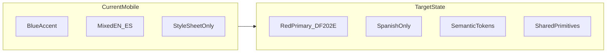
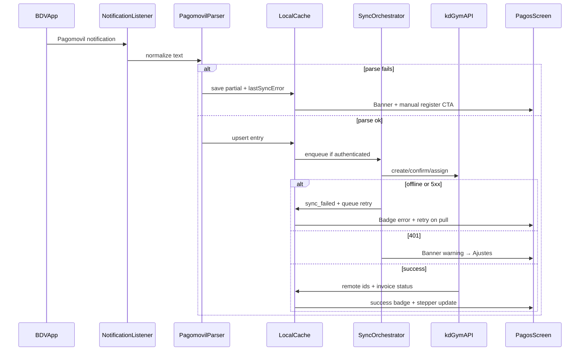

# kd-gym UI/UX Alignment & Workflow Improvement Plan

## Current state vs target

The mobile app and kd-gym web app share **API integration only** — not visual identity.

| Dimension | Mobile app today | kd-gym web ([`kd-gym/app/globals.css`](file:///Users/optec-123/Desktop/Allan-Projects/kd-gym/app/globals.css)) |
|-----------|------------------|----------------------------------------------------------------|
| Primary accent | Blue `#6C9EFF` / `#3B6FE8` | Brand red `oklch(0.58 0.22 25)` ≈ **`#DF202E`** |
| Background | `#0F1117` slate | Dark blue-gray `oklch(0.13 0.01 250)` ≈ **`#05080B`** |
| Surface/card | `#1A1D27` | `oklch(0.17 0.01 250)` ≈ **`#0C1014`** |
| Border radius | 8–20px mixed | Base **`8px`** (`0.5rem`), cards `rounded-xl` |
| Typography | System font + SpaceMono | **Geist Sans** + **Geist Mono** |
| Theme mode | Manual dark/light toggle | Dark-only on web |
| Language | Mixed EN/ES | Spanish (via next-intl on web) |

**Your preferences:** full light + dark themes using kd-gym brand colors; **Spanish only** across all screens.

---

## Phase 1 — Design token foundation (source of truth)

**Goal:** One token file that mirrors kd-gym semantic naming so every screen pulls from the same palette.

### 1.1 Replace [`constants/theme.ts`](constants/theme.ts) with kd-gym-aligned tokens

Map kd-gym CSS variables to React Native semantic keys:

| kd-gym token | RN key | Dark (~hex) | Light (derived) |
|--------------|--------|-------------|-----------------|
| `--background` | `background` | `#05080B` | `#FAFAFA` |
| `--foreground` | `text` | `#F5F5F5` | `#0A0A0A` |
| `--card` | `surface` | `#0C1014` | `#FFFFFF` |
| `--secondary` | `surfaceElevated` | `#171B1F` | `#F4F4F5` |
| `--primary` | `primary` | `#DF202E` | `#DF202E` |
| `--primary-foreground` | `primaryForeground` | `#F8F8F8` | `#FFFFFF` |
| `--muted-foreground` | `textMuted` | `#8F8F8F` | `#71717A` |
| `--border` | `border` | `#25292E` | `#E4E4E7` |
| `--destructive` | `danger` | `#D40924` | `#DC2626` |
| `--success` | `success` | `#11AD32` | `#16A34A` |
| `--warning` | `warning` | `#D9A514` | `#CA8A04` |
| `--accent` (subtle bg) | `accentSurface` | `#1A222B` | `#F4F4F5` |
| `--ring` | `ring` | `#DF202E` | `#DF202E` |

- Keep backward-compat aliases temporarily (`accent` → `primary`) to minimize churn, then migrate call sites.
- Align radius to kd-gym: base `8`, `sm: 5`, `md: 6`, `lg: 8`, `xl: 11`, `2xl: 14` (from kd-gym `--radius` scale).
- Add `typography` tokens: `heading`, `body`, `caption`, `mono` sizes/weights.

### 1.2 Add [`constants/kd-gym-brand.ts`](constants/kd-gym-brand.ts)

Centralize brand assets and copy:

- `KD_GYM_LOGO` (copy from [`kd-gym/public/images/logo.png`](file:///Users/optec-123/Desktop/Allan-Projects/kd-gym/public/images/logo.png) → `assets/images/kd-gym-logo.png`)
- App display name: **"KD-Gym Pagos"** (or similar — staff-facing, Spanish)
- Default API URL stays in [`constants/api-defaults.ts`](constants/api-defaults.ts)

### 1.3 Typography — load Geist in Expo

In [`app/_layout.tsx`](app/_layout.tsx):

- Add `@expo-google-fonts/geist` or bundle Geist `.ttf` files (Expo SDK 56 compatible per [Expo fonts docs](https://docs.expo.dev/versions/v56.0.0/)).
- Replace SpaceMono usage with Geist Mono for refs/amounts (matches kd-gym tables).
- Apply `fontFamily` via new `ThemedText` primitive (Phase 2).

### 1.4 Native shell branding

Update [`app.json`](app.json):

- Splash + adaptive icon background → `#05080B` (kd-gym dark background)
- `userInterfaceStyle: "automatic"` — wire to system preference in Phase 3

### 1.5 Remove dead styling paths

- Deprecate [`constants/Colors.ts`](constants/Colors.ts) and [`components/Themed.tsx`](components/Themed.tsx) (only used by `+not-found.tsx`).
- **Decision:** Do **not** wire NativeWind in this effort — it is installed but unused (no `tailwind.config`, no `className`). Token-first StyleSheet approach is lower risk and matches current codebase patterns. Remove `nativewind`/`tailwindcss` from dependencies in a cleanup pass if not planned.

---

## Phase 2 — Shared component library (kd-gym visual parity)

**Goal:** Reusable primitives that mirror kd-gym shadcn patterns without porting web components directly.

Reference kd-gym components: [`button.tsx`](file:///Users/optec-123/Desktop/Allan-Projects/kd-gym/components/ui/button.tsx), [`card.tsx`](file:///Users/optec-123/Desktop/Allan-Projects/kd-gym/components/ui/card.tsx), [`badge.tsx`](file:///Users/optec-123/Desktop/Allan-Projects/kd-gym/components/ui/badge.tsx).

### 2.1 Core primitives (`components/ui/`)

| Component | kd-gym equivalent | Key specs |
|-----------|-------------------|-----------|
| `Button` | `Button` | Red primary, `rounded-lg` (8px), minHeight 40/48, haptics, disabled opacity 50%, focus ring simulation |
| `Card` | `Card` | `surface` bg, `border` ring, `rounded-xl` (14px), header/content/footer slots |
| `Badge` | `Badge` | Status pills for payment sync states (primary/destructive/outline) |
| `Banner` | — (new) | Variants: `info`, `warning`, `error`, `success`; optional CTA ("Ir a Ajustes") |
| `TextInput` | `Input` | `input` bg, `border`, focus ring color `ring`, consistent height |
| `SettingRow` | — | Label + control row for Settings screen |
| `ThemedText` | — | Typography variants using Geist |

### 2.2 Refactor existing shared components

| File | Changes |
|------|---------|
| [`PrimaryButton.tsx`](components/shared/PrimaryButton.tsx) | Wrap `Button`; primary = red `#DF202E`, not blue |
| [`EmptyState.tsx`](components/shared/EmptyState.tsx) | Use `Card`; kd-gym muted description color |
| [`SkeletonCard.tsx`](components/shared/SkeletonCard.tsx) | Pulse on `secondary` surface (kd-gym skeleton pattern) |
| [`AppScreen.tsx`](components/shared/AppScreen.tsx) | kd-gym header hierarchy; optional logo slot; consistent padding |
| [`FilterChips.tsx`](components/shared/FilterChips.tsx) | Selected = `primary` red; unselected = `secondary` |

### 2.3 Domain components

| File | Changes |
|------|---------|
| [`PaymentRegisterCard.tsx`](components/payments/PaymentRegisterCard.tsx) | `Card` + `Badge` for sync status; Geist Mono for amount/ref |
| [`PaymentStatusStepper.tsx`](components/payments/PaymentStatusStepper.tsx) | Active step = `primary` red |
| [`PaymentDetailSheet.tsx`](components/payments/PaymentDetailSheet.tsx) | Sheet bg = `surfaceElevated`; error text = `danger` |
| [`ManualRegisterForm.tsx`](components/payments/ManualRegisterForm.tsx) | Shared `TextInput`; inline validation states |
| [`AssignClientSheet.tsx`](components/payments/AssignClientSheet.tsx) | Empty search state + error state (currently missing) |

### 2.4 Navigation chrome

[`app/(tabs)/_layout.tsx`](app/(tabs)/_layout.tsx):

- Tab labels: **Pagos · BDV · Ajustes** (Spanish)
- Active tint = `primary` red
- Tab bar bg = `surface`, top border = `border`

---

## Phase 3 — Screen-by-screen UX pass (Spanish only)

### 3.1 Onboarding flow

Files: [`app/onboarding/*.tsx`](app/onboarding/)

| Screen | UI/UX improvements |
|--------|-------------------|
| Welcome | kd-gym logo, Spanish copy, red CTA; rename from "BDV Notification Reader" |
| Access | Step indicator (1/4); clearer permission illustration |
| Battery | OEM-specific guidance card (Xiaomi/Samsung) |
| Connect | Use `getUserErrorMessage` for inline errors; success haptic + toast |

### 3.2 Pagos tab (primary workflow)

[`app/(tabs)/feed.tsx`](app/(tabs)/feed.tsx)

- Replace inline banner `View` with shared `Banner` component
- Banner variants by state:
  - **Warning:** session expired → tap navigates to Ajustes
  - **Info:** pending sync count
  - **Error:** last sync failure
- Add mutation error toasts on confirm/assign (gap: [`use-payment-registers.ts`](hooks/use-payment-registers.ts) has no `onError`)
- Manual form: validate before submit; show field-level errors (pago format, required mobile/ref)
- Pull-to-refresh: subtle kd-gym red tint on `RefreshControl`

### 3.3 Ajustes tab

[`app/(tabs)/settings.tsx`](app/(tabs)/settings.tsx)

Translate all English strings:

- Title **"Ajustes"**, subtitle **"Privacidad, sincronización y almacenamiento"**
- Alerts: "¿Borrar todo el historial?", retention labels, theme toggle labels
- Replace raw `Alert.alert` error bodies with [`getUserErrorMessage`](lib/utils/user-error-message.ts)
- Group into `Card` sections: Conexión kd-gym · Apariencia · Almacenamiento · Diagnóstico
- Theme toggle: **Oscuro / Claro / Sistema** (new system option using `useColorScheme`)

### 3.4 BDV tab

[`app/(tabs)/apps.tsx`](app/(tabs)/apps.tsx) — Spanish copy, `Card` layout, status badge for listener permission

### 3.5 Orphan components — decide fate

Built but unused: `NotificationCard`, `NotificationDetailSheet`, `AppRow`, `ManualPackageForm`.

- **Recommendation:** Remove from v1 payment-focused app OR relocate to a hidden "Historial" tab if notification timeline is still needed. Avoid maintaining dead UI.

---

## Phase 4 — Workflow analysis & edge-case framework

**Goal:** Systematic coverage of payment capture → sync → invoice assignment, with visible UX for every failure mode.

### 4.1 Edge-case matrix (implement UX for each)

| Edge case | Detection | UX response |
|-----------|-----------|-------------|
| Notification access revoked | `hasPermission` poll on focus | Blocking banner + onboarding CTA |
| Redacted BDV body | `isRedacted` flag | Card shows "Contenido oculto" + manual entry |
| Duplicate payment ref | dedupe key collision | Badge "Duplicado", no double sync |
| Session expired mid-action | 401 on confirm/assign | Toast + banner + disable sync actions |
| No internet | fetch TypeError / status 0 | Banner + offline icon on cards |
| Client search empty | zero results | EmptyState "Sin clientes" + create flow |
| Client search error | query error | Inline error + retry |
| Manual pago invalid | parser throw | Field error under input |
| Queue stuck | pendingJobs > 0 long | Diagnostics in Ajustes + "Reintentar sync" |
| Light mode contrast | WCAG check on red on white | Ensure `primary` meets 4.5:1 on light bg |

### 4.2 Observability for UX friction (lightweight)

Extend [`lib/logger.ts`](lib/logger.ts) with structured UX events (no PII):

- `ux.banner_shown`, `ux.manual_register_opened`, `ux.sync_retry`, `ux.auth_redirect`
- Enables post-hoc analysis of where users get stuck without a full analytics SDK initially

### 4.3 Sync status vocabulary (Spanish, consistent)

Unify status strings across cards, banners, sheets, and [`PaymentRegisterService`](lib/services/payments/PaymentRegisterService.ts):

- `pending` → "Pendiente de sync"
- `sync_failed` → "Error de sincronización"
- `payment_confirmed` → "Pago confirmado"
- `client_assigned` → "Cliente asociado"

---

## Phase 5 — Polish & QA checklist

### Visual QA (side-by-side with kd-gym web)

- [ ] Primary buttons are red, not blue
- [ ] Background/surface hierarchy matches kd-gym dark
- [ ] Light mode preserves red brand, readable contrast
- [ ] Geist renders on Android device
- [ ] Logo appears on splash + onboarding
- [ ] Tab bar, sheets, cards feel cohesive

### UX QA (physical Android device)

- [ ] Full onboarding in Spanish
- [ ] Receive BDV notification → card appears with correct styling
- [ ] Session expire → banner with navigation to Ajustes
- [ ] Confirm payment failure → toast + inline error
- [ ] Assign client: empty search, error, success paths
- [ ] Theme toggle: dark / light / system
- [ ] Pull-to-refresh during offline shows friendly message

### Code hygiene

- [ ] Remove legacy `Colors.ts` / `Themed.tsx`
- [ ] Remove or integrate orphan notification/whitelist components
- [ ] All hardcoded `#FFFFFF`, `12`, `20` radius → tokens
- [ ] Typecheck + existing tests pass

---

## Recommended implementation order

```mermaid
gantt
  title ImplementationPhases
  dateFormat X
  axisFormat %s

  section Foundation
  TokensAndFonts     :0, 2
  BrandAssets        :1, 1

  section Components
  UIPrimitives       :2, 3
  RefactorShared     :3, 2
  RefactorPayments   :4, 2

  section Screens
  SpanishCopy        :3, 3
  Onboarding         :5, 2
  PagosWorkflow      :6, 3
  AjustesBDV         :7, 2

  section Hardening
  EdgeCases          :8, 3
  QAAndCleanup       :10, 2
```

**Estimated effort:** 3–4 focused dev sessions for Phases 1–3 (visible brand alignment); +1–2 sessions for Phase 4 edge cases and QA.

---

## Key files to change (priority order)

1. [`constants/theme.ts`](constants/theme.ts) — kd-gym token swap
2. [`hooks/use-theme-colors.ts`](hooks/use-theme-colors.ts) — system theme support
3. [`components/shared/PrimaryButton.tsx`](components/shared/PrimaryButton.tsx) + new `components/ui/*`
4. [`app/(tabs)/_layout.tsx`](app/(tabs)/_layout.tsx) — tab chrome
5. [`app/(tabs)/feed.tsx`](app/(tabs)/feed.tsx) — banner, mutation errors
6. [`app/(tabs)/settings.tsx`](app/(tabs)/settings.tsx) — Spanish + cards
7. [`app/onboarding/index.tsx`](app/onboarding/index.tsx) — brand welcome
8. [`hooks/use-payment-registers.ts`](hooks/use-payment-registers.ts) — error toasts
9. [`app.json`](app.json) — splash/icon colors

## Out of scope (defer)

- Porting kd-gym shadcn components to React Native verbatim
- Wiring NativeWind/Tailwind (dependency cleanup only)
- Full i18n framework (hardcode Spanish strings for now; extract to `constants/copy.ts` for maintainability)
- Notification timeline tab (unless product confirms need)
