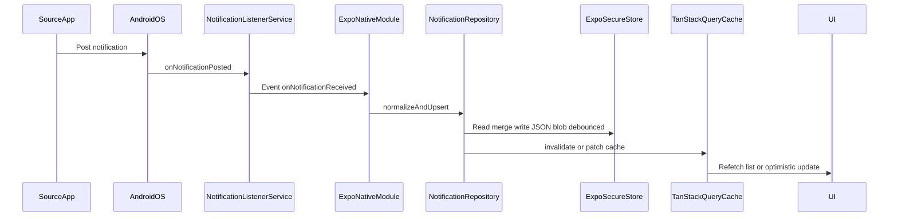
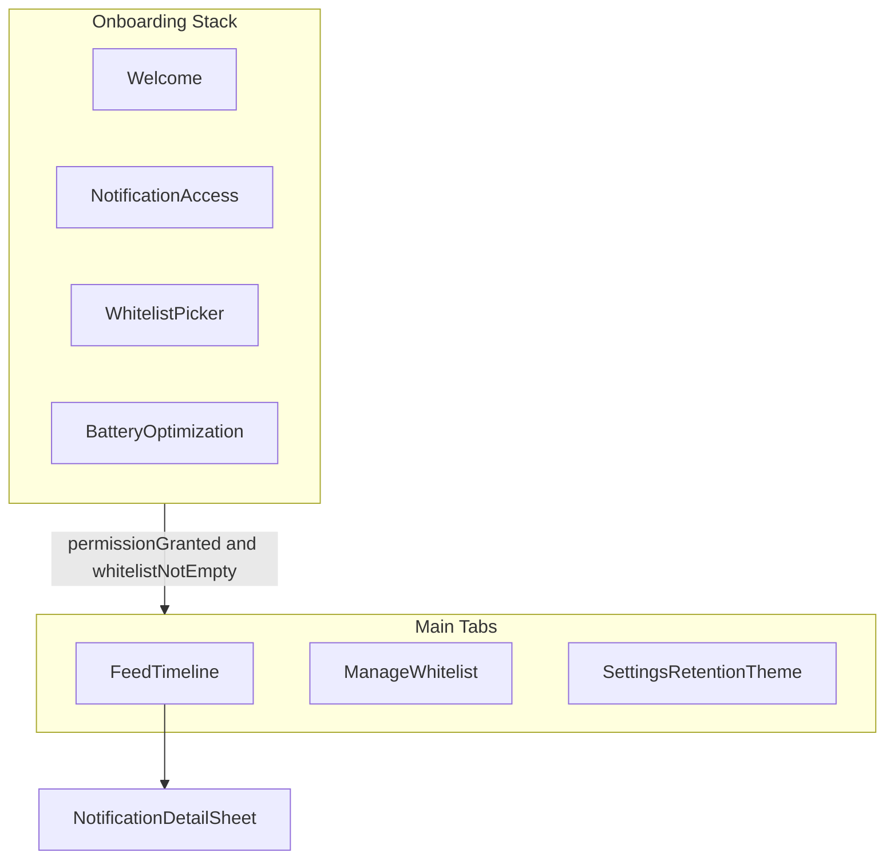
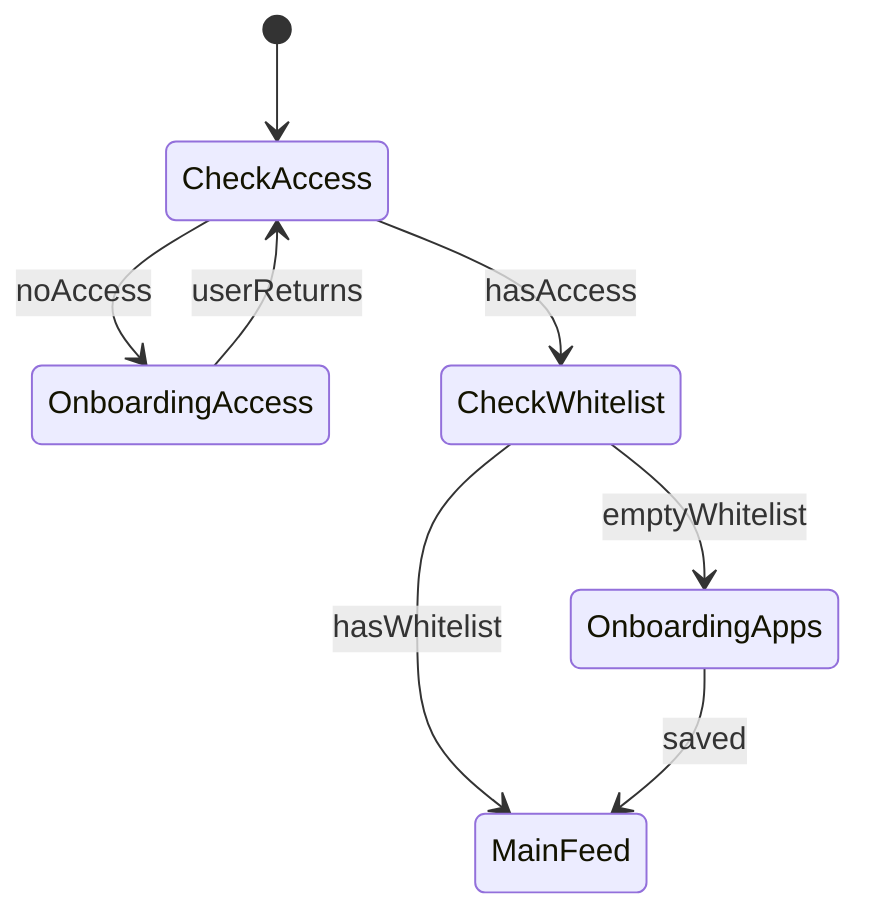

# Notification Reader — Comprehensive Build Plan

## Executive summary

**Feasible and aligned with your choices:** Android-only, **whitelist** of packages, **local persistence first** (`expo-secure-store` — encrypted secure storage, no SQLite in v1), React Native + Expo **development build** (not Expo Go), [`expo-android-notification-listener-service`](https://github.com/SeokyoungYou/expo-android-notification-listener-service) for `NotificationListenerService`, **TanStack Query** for async data orchestration, **Zustand** for persistent UI prefs, and your [Frontend](file:///Users/optec-123/Desktop/webtrixpro/rules/Frontend%20Rules.md), [Layered Architecture](file:///Users/optec-123/Desktop/webtrixpro/rules/Layered%20Architecture%20rules.md), and [Project-Wide](file:///Users/optec-123/Desktop/webtrixpro/rules/Project-Wide%20Rules.md) rules adapted from Next.js CMS to mobile.

The workspace [`notification-reader`](/Users/optec-123/Desktop/Allan-Projects/notification-reader) is **empty** — this is a greenfield implementation.

---

## 1. Systematic workflow analysis (inefficiencies and edge cases)

### 1.1 End-to-end capture workflow



| Stage | Hidden inefficiency | Mitigation |
|-------|-------------------|------------|
| Native → JS burst | Main thread + JS bridge floods on busy apps | Batch writes in repository (debounce 100–300ms), use `FlashList` + infinite query |
| Duplicate posts | Same notification key updated (chat apps) | Upsert on `(packageName, notificationKey, postTime)` not blind INSERT |
| Listener without JS | Events while app killed | v1: events only persist when JS runs ingest; on resume, full reload from SecureStore + optional native reconcile if module adds it later |
| Whitelist drift | User removes app from whitelist but events still cached | `setAllowedPackages` on change + optional purge mutation for deselected packages |
| Permission revoked | Silent failure — empty feed | Poll `hasPermission` on `AppState` focus; gate UI with blocking onboarding |
| Redacted content | Title-only from banking/chat | Store `isRedacted` flag; UI shows “Content hidden by app” |
| Removed notifications | User dismisses from shade | Listen for `onNotificationRemoved` (if exposed) or mark `dismissedAt` when detectable |
| Battery/OEM kill | Listener stops on Xiaomi/Samsung | Onboarding step: battery optimization exemption + deep link to OEM settings |
| Large history | SecureStore value size limits (~2KB per key on some platforms; Android more generous) | Hard **retention cap** (e.g. 500 records), prune on write, optional chunked keys `notifications:chunk:N`; client-side pagination after load |
| SecureStore write churn | Full JSON rewrite on every notification | Debounced batch writes (100–300ms); in-memory index Map between loads |
| Storage full / write fail | `setItemAsync` throws | Catch in repository; toast via `useGlobalErrorHandler`; auto-purge oldest 10% and retry once |

### 1.2 Edge-case matrix (must implement explicitly)

| Edge case | Detection | UX / data behavior |
|-----------|-----------|-------------------|
| Notification access OFF | `Settings.Secure.ENABLED_NOTIFICATION_LISTENERS` via module API | Full-screen onboarding; CTA opens system settings |
| Whitelist empty | Zustand `allowedPackages.length === 0` | Block capture; prompt “Select apps” |
| First launch after install | Empty SecureStore key | Empty state + guided whitelist setup |
| App updated (package change rare) | Same `packageName` | No special case |
| Group summary vs child | `NotificationData` group key fields | Collapse in UI by `groupKey` |
| Timezone / clock change | `postTime` from system | Store UTC epoch ms only |
| Export later (phase 2) | User request | Add mutation + share sheet — out of v1 scope unless you expand |

---

## 2. Architecture — WebTrixPro rules adapted to React Native

Your CMS rules map cleanly if you **replace the Endpoint + PostgreSQL layers** with **Native Bridge + Secure Storage**.

| CMS layer | Mobile equivalent | Path pattern |
|-----------|-------------------|----------------|
| Screen | Expo Router screens | [`app/`](app/) e.g. `app/(tabs)/index.tsx`, `app/onboarding.tsx` |
| Component | Presentational UI | [`components/[feature]/`](components/) |
| Hook | TanStack Query + listeners | [`hooks/use-notifications.ts`](hooks/) |
| Service | Orchestration, no direct UI | [`lib/services/notifications/NotificationService.ts`](lib/services/) |
| Endpoint | **Native module + storage repository** | [`lib/services/native/NotificationListenerBridge.ts`](lib/services/native/) |
| Data | **expo-secure-store** | [`lib/storage/`](lib/storage/) — keys, read/write, chunking |

### 2.1 State decision tree (from Frontend Rules)

- **Server/async data (notifications, permission, app list):** TanStack Query  
- **Shared persistent prefs (whitelist, theme, retention days):** Zustand with **custom persist adapter** backed by `expo-secure-store` (same storage layer as notifications)  
- **Feature context (onboarding step):** React Context (optional, small scope)  
- **UI-only (sheet open, search input):** `useState`

### 2.2 Cross-cutting project rules

- **No `any`** — extend module types in [`types/notification/notification.types.ts`](types/notification/)  
- **Zod schemas** in [`types/notification/notification.schemas.ts`](types/notification/) for stored records, blob envelope, and filter DTOs  
- **Centralized query keys** in [`lib/query-keys.ts`](lib/query-keys.ts) e.g. `notifications.all → lists → list(filters) → detail(id)`  
- **Logger** at [`lib/logger.ts`](lib/logger.ts) — no `console.log`  
- **Feedback** — toast/banner via [`hooks/use-global-error-handler.ts`](hooks/use-global-error-handler.ts) (mobile: `burnt` or custom toast)  
- **Component file order:** imports → interfaces → hooks → early returns → render  

### 2.3 React Query role (no remote API)

Treat Secure Storage + native bridge as **async data sources**:

| Query / mutation | Source | Invalidation trigger |
|------------------|--------|----------------------|
| `useNotificationsInfiniteQuery(filters)` | `NotificationService.list()` | Native `onNotificationReceived`, manual refresh |
| `useNotificationDetailQuery(id)` | `NotificationService.get(id)` | Row update |
| `useNotificationAccessQuery()` | Bridge `hasPermission` | `AppState` active |
| `useInstalledAppsQuery()` | `InstalledAppsService` (launcher apps) | Whitelist screen mount |
| `useClearHistoryMutation()` | `NotificationService.clear()` | `onSuccess` → invalidate lists |
| `useUpdateWhitelistMutation()` | Zustand persist + `setAllowedPackages` | Immediate native sync |

**Pattern:** Native subscription in a single [`hooks/use-notification-listener.ts`](hooks/use-notification-listener.ts) calls `queryClient.invalidateQueries({ queryKey: queryKeys.notifications.lists() })` or uses `setQueryData` for incremental updates when dedupe key exists.

---

## 3. Tech stack (recommended)

| Concern | Choice | Rationale |
|---------|--------|-----------|
| Framework | Expo SDK **52+**, TypeScript | Matches notification listener module |
| Routing | `expo-router` | File-based screens like `/app` |
| Dev build | `expo-dev-client` + `npx expo run:android` | Required for native module |
| Listener | `expo-android-notification-listener-service` | `setAllowedPackages`, typed events |
| Persistence | **`expo-secure-store`** | Encrypted at rest (Android: EncryptedSharedPreferences); fits personal-use v1 without SQLite |
| Query | `@tanstack/react-query` v5 | Per your requirement |
| Client state | `zustand` + persist middleware | Whitelist, theme, filters |
| UI styling | **NativeWind v4** (Tailwind mobile-first) | Aligns with Project-Wide 360px rule |
| Lists | `@shopify/flash-list` | Performance |
| Motion | `react-native-reanimated` + `moti` | Skeletons, micro-interactions |
| Sheets | `@gorhom/bottom-sheet` | Filters, notification detail |
| Icons | `lucide-react-native` | Consistent iconography |
| Forms | `react-hook-form` + `@hookform/resolvers/zod` | Whitelist search/settings |
| Haptics | `expo-haptics` | Subtle feedback on capture toggle |
| Installed apps | `react-native-installed-apps` or thin Expo module | Whitelist picker data |

**Explicitly out of v1:** iOS, Expo Go, remote backend, Auth0.

---

## 4. Data model (granular capture)

```typescript
// types/notification/notification.types.ts (conceptual)
interface NotificationRecord {
  id: string;                    // uuid
  packageName: string;
  appLabel: string;
  title: string | null;
  body: string | null;
  bigText: string | null;
  postTime: number;              // epoch ms UTC
  notificationKey: string;         // stable dedupe from native
  groupKey: string | null;
  isGroupSummary: boolean;
  isRedacted: boolean;
  isOngoing: boolean;
  dismissedAt: number | null;
  rawPayloadJson: string | null; // optional debug for personal use
  createdAt: number;
  updatedAt: number;
}
```

**In-memory indexes (built on load, not on disk):** `Map` by `id`, dedupe key `(packageName, notificationKey)` for upsert; sort by `postTime DESC` for feed.

**Secure Storage layout (v1):**

| Key | Content |
|-----|---------|
| `nr:notifications:v1` | Primary JSON: `{ version, records: NotificationRecord[] }` (cap enforced before write) |
| `nr:prefs:v1` | Optional separate blob for Zustand rehydration (whitelist, theme, retentionDays) |
| `nr:meta:v1` | `{ lastWriteAt, recordCount }` for health checks |

If primary blob exceeds safe size (~1–1.5MB conservative), split into `nr:notifications:chunk:0..N` (phase 1b only if stress test requires it).

**Zustand whitelist store:** `allowedPackages: string[]`, `appLabels: Record<string, string>` — persisted via SecureStore adapter.

---

## 4.1 Secure storage constraints (v1 design guardrails)

- **No SQL queries:** list/filter/search run in-memory after one async `getItemAsync` (cached in repository singleton for session).
- **Pagination:** TanStack `useInfiniteQuery` slices the in-memory sorted array (cursor = offset), not DB cursors.
- **Retention default:** 30 days and/or max 500 records — whichever stricter — enforced in `NotificationRepository` before every write.
- **Sensitive data:** titles/bodies stay in encrypted storage; disable `rawPayloadJson` by default in settings.
- **Future migration path:** if history outgrows SecureStore, swap Data layer to SQLite behind same `NotificationRepository` interface without changing hooks/UI.

---

## 5. UI/UX — high-level modern design

### 5.1 Design direction (2025–2026 mobile trends, personal tool)

- **Material You–inspired dynamic surfaces:** soft elevated cards, 16–20px radius, subtle border (`border-white/10` dark)
- **Typography:** large title (feed), monospace timestamp in detail, clear hierarchy (app → title → body)
- **Default dark theme** with optional light (Zustand) — reduces glare for notification-heavy use
- **Timeline feed** grouped by **Today / Yesterday / date**, subsection per **app** (avatar + label from whitelist metadata)
- **Skeleton screens** mirroring card layout (not spinners) — Frontend Rules compliance
- **Empty states:** illustrated + single primary CTA (“Enable access”, “Add apps”)
- **Bottom sheet** for notification detail + copy actions
- **Sticky filter chip row:** app filter, search, “ongoing only”
- **Onboarding:** 3-step carousel (Why → Notification access → Pick apps → Battery tip)
- **Accessibility:** `accessibilityLabel` on icon buttons, min 44dp touch targets, screen reader announcements on new items (optional toggle)

### 5.2 Screen map



| Screen | Purpose |
|--------|---------|
| `app/index.tsx` | Redirect: onboarding vs tabs based on gates |
| `app/onboarding/*` | Permission + whitelist setup |
| `app/(tabs)/feed.tsx` | Infinite notification list |
| `app/(tabs)/apps.tsx` | Installed apps search + toggle whitelist |
| `app/(tabs)/settings.tsx` | Retention days, theme, clear history, debug |

### 5.3 UX gates (no confusing empty feed)



---

## 6. Feature modules and file tree

```
notification-reader/
├── app/
│   ├── _layout.tsx              # QueryClientProvider, theme, error boundary
│   ├── index.tsx
│   ├── onboarding/
│   └── (tabs)/
├── components/
│   ├── shared/                  # AppScreen, SkeletonCard, EmptyState, ErrorBoundary
│   ├── notifications/           # NotificationCard, TimelineSection, DetailSheet
│   ├── whitelist/               # AppRow, AppSearchForm
│   └── onboarding/
├── hooks/
│   ├── use-notifications.ts
│   ├── use-notification-listener.ts
│   ├── use-notification-access.ts
│   └── use-global-error-handler.ts
├── lib/
│   ├── query-keys.ts
│   ├── logger.ts
│   ├── storage/                 # secure-store keys, read/write, chunking, Zustand adapter
│   ├── services/
│   │   ├── base/                # BaseStorageRepository pattern (CRUD analogue to BaseService)
│   │   ├── notifications/
│   │   ├── native/
│   │   └── installed-apps/
│   └── utils/
├── stores/
│   ├── whitelist-store.ts
│   └── preferences-store.ts
└── types/
    └── notification/
```

Implement features in **Layered Architecture checklist order:** types/schemas → services → hooks → components → screens.

---

## 7. Step-by-step implementation framework

### Phase 0 — Project bootstrap (Day 1)

1. `npx create-expo-app@latest notification-reader -t tabs` with TypeScript  
2. Add `expo-dev-client`, `expo-router`, NativeWind, TanStack Query, Zustand, **expo-secure-store**, FlashList, bottom-sheet, listener package  
3. Configure `app.json`: Android package name, `permissions`, plugin config for notification listener (per module docs)  
4. Scaffold `lib/logger.ts`, `lib/query-keys.ts`, path aliases (`@/`)  
5. First **development build:** `npx expo prebuild` + `npx expo run:android` on physical device (emulator works but real notifications are better)

### Phase 1 — Data layer (Day 2–3)

1. Define `NotificationRecord` + `NotificationStoreEnvelope` Zod schemas (versioned blob for forward compatibility)  
2. `SecureStorageClient` in [`lib/storage/secure-storage-client.ts`](lib/storage/secure-storage-client.ts): `getJson`, `setJson`, error handling, optional chunking helpers  
3. `NotificationRepository` extending base storage CRUD: `loadAll`, `upsertFromNative`, `listSlice(offset, limit, filters)`, `getById`, `purgeOlderThan`, `deleteByPackage`, `clearAll` — all operate on in-memory collection with debounced `setJson`  
4. Zustand `persist` storage adapter reusing `SecureStorageClient` for prefs/whitelist  
5. Unit-test dedupe/upsert/retention-cap logic with fixture payloads (mock storage, no device required)

### Phase 2 — Native bridge service (Day 3–4)

1. `NotificationListenerBridge.ts` wraps module: `requestAccess()`, `checkAccess()`, `setAllowedPackages()`, `subscribeToEvents()`  
2. `use-notification-listener.ts`: subscribe once at root layout; on event → `NotificationService.ingest()` → query invalidation  
3. Sync whitelist from Zustand on app start and on store change  
4. Handle `AppState` resume: re-check access + reconcile missed events (full refresh query)

### Phase 3 — TanStack Query hooks (Day 4–5)

1. `useNotificationsInfiniteQuery` with filters (package, search, date)  
2. `useNotificationAccessQuery` with staleTime 0 on focus  
3. `useInstalledAppsQuery` for whitelist UI  
4. Mutations: `clearHistory`, `purgeRetention`, `removePackageFromWhitelist`  
5. Global error handler integration for mutation failures

### Phase 4 — Onboarding + whitelist UX (Day 5–7)

1. Onboarding screens with Reanimated transitions  
2. Installed apps list with search (React Hook Form + Zod)  
3. Persist whitelist; call `setAllowedPackages`  
4. Battery optimization education screen (link to `Linking.openSettings`)  
5. Gate `app/index.tsx` routing on access + whitelist

### Phase 5 — Feed UI (Day 7–10)

1. `NotificationCard` + timeline grouping utility in `lib/utils/group-notifications.ts`  
2. FlashList infinite scroll wired to infinite query  
3. Skeleton loading state component  
4. Empty/error states  
5. Detail bottom sheet + copy-to-clipboard  
6. Filter chips → query key includes filter hash

### Phase 6 — Settings + retention (Day 10–11)

1. Retention days preference → scheduled purge on app launch  
2. Theme toggle (Zustand)  
3. Clear all history mutation with confirmation dialog  
4. Optional: “Capture raw JSON” debug toggle (off by default)

### Phase 7 — Hardening + quality gates (Day 11–14)

1. **P0 audit:** no `any`, no `console.log`, prop interfaces on all components  
2. Listener cleanup on unmount; verify no duplicate subscriptions  
3. Stress test: rapid notifications from one whitelisted app  
4. Document OEM-specific troubleshooting in [`README.md`](README.md)  
5. Manual test matrix from section 1.2 on physical device  

### Phase 8 — Future enhancements (post-v1)

- Export JSON/CSV share sheet  
- Analytics dashboard (counts by app/hour)  
- Keyword rules engine  
- Foreground service notification if Android 14+ restricts background (only if needed)

---

## 8. Android manifest and permissions checklist

- Bind `NotificationListenerService` (via Expo config plugin / module)  
- `QUERY_ALL_PACKAGES` or `<queries>` intent for installed-app picker (minimize scope where possible)  
- Post notifications permission for **your** app only if you add a foreground service later  
- ProGuard rules if release build minifies native module  

---

## 9. Testing strategy

| Layer | Method |
|-------|--------|
| Repository dedupe | Jest unit tests |
| Query key invalidation | Integration test with mock bridge |
| UI | Manual on device: access on/off, whitelist change, dismiss notifications |
| Performance | Log ingest latency; target &lt; 100ms debounced SecureStore write; &lt; 30ms in-memory upsert |

---

## 10. Success criteria

- User enables notification access and selects ≥1 app  
- Notifications from **non-whitelisted** apps never appear in storage or UI  
- Notifications persist across app restarts (SecureStore) and appear in paginated feed  
- Loading, empty, error, and permission-revoked states are explicit and polished  
- Codebase follows adapted six-layer structure, TanStack Query, Zod, Zustand, typed props, centralized logger and query keys  

---

## 11. Key risks and decisions already locked

| Risk | Mitigation |
|------|------------|
| Module maturity (low GitHub stars) | Abstract behind `NotificationListenerBridge`; swap implementation if needed |
| Expo Go unusable | Document dev build only in README |
| Installed apps API fragmentation | Fallback: manual package name entry in settings (advanced) |
| Chat apps redact body | `isRedacted` UX; no false promise of full text |
| SecureStore size limits | Retention cap + debounced writes + purge-on-failure; chunk keys only if needed |

**Locked by your answers:** whitelist-only capture, **expo-secure-store** persistence in v1 (SQLite deferred to future migration behind repository interface).
