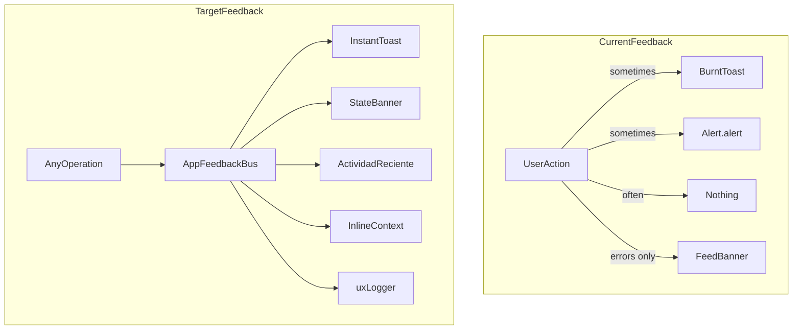

# Process Feedback & Error UX System

## Problem analysis

Today feedback is **fragmented and incomplete**:

| Channel | Used where | Problem |
|---------|------------|---------|
| Burnt toasts | Pagos confirm/assign/manual only | 3 of ~15 workflow steps |
| `Alert.alert` | Ajustes login/test/rescan | Blocks UI; inconsistent with Pagos |
| `Banner` | Pagos auth/sync state only | `error`/`success` variants unused |
| Inline text | Forms, detail sheet | Per-entry errors hidden on list cards |
| Silent | Background sync, pull refresh, queue retry, shade sync, logout | User has no idea what happened |

**Critical UX bug:** [`confirmPayment`](lib/services/payments/PaymentRegisterService.ts) and [`assignClient`](lib/services/payments/PaymentRegisterService.ts) return success when the action was only **queued** (no `remoteRegisterId`), but [`feed.tsx`](app/(tabs)/feed.tsx) always shows `"Pago confirmado"` / `"Cliente asociado"`.



**Your preference:** toasts + banners + **collapsible "Actividad reciente" panel** in Ajustes.

---

## Design principles (2025 mobile UX)

1. **Honest outcomes** — distinguish `completed`, `queued`, `partial`, `failed`, `skipped` (never claim "confirmado" when only enqueued).
2. **One feedback bus** — single API; no direct `Alert.alert` / scattered Burnt calls in screens.
3. **Layered surfaces** — toast for instant result; banner for ongoing state; activity log for audit trail; inline for field/entry context.
4. **Actionable errors** — every error message includes what to do next ("Reintenta", "Ve a Ajustes", "Registro manual").
5. **Haptics on truth** — move success haptic in [`PaymentDetailSheet`](components/payments/PaymentDetailSheet.tsx) to fire only after confirmed server result, not on button press.
6. **Non-blocking** — replace success/info `Alert.alert` with toasts; keep native confirm dialogs only for destructive actions (clear history/cache).

---

## Phase 1 — Feedback architecture (foundation)

### 1.1 Operation outcome model

New file: [`types/feedback/operation-outcome.types.ts`](types/feedback/operation-outcome.types.ts)

```typescript
type OperationStatus = 'completed' | 'queued' | 'partial' | 'failed' | 'skipped';
type OperationKind =
  | 'capture_notification' | 'shade_sync' | 'manual_register'
  | 'confirm_payment' | 'assign_client' | 'pull_sync' | 'queue_retry'
  | 'login' | 'logout' | 'test_connection' | 'clear_cache' | ...;

interface OperationOutcome {
  kind: OperationKind;
  status: OperationStatus;
  title: string;       // short toast title
  message: string;     // user-facing detail
  actionLabel?: string;
  actionRoute?: string;
  meta?: Record<string, string | number>; // created, pendingJobs, etc.
}
```

### 1.2 Message formatter

New file: [`lib/feedback/format-operation-outcome.ts`](lib/feedback/format-operation-outcome.ts)

- Input: `PaymentSyncResult`, `PaymentRegisterCacheEntry`, shade sync stats, errors
- Output: `OperationOutcome` with Spanish copy from extended [`constants/copy.ts`](constants/copy.ts) (`copy.feedback.*`)
- Reuses [`getUserErrorMessage`](lib/utils/user-error-message.ts) for all error paths

Example honest messages:

| Situation | Title | Message |
|-----------|-------|---------|
| Confirm queued offline | Pendiente de sync | El pago se confirmará cuando haya conexión con kd-gym. |
| Confirm on server | Pago confirmado | Factura actualizada en kd-gym. |
| Pull sync OK | Sincronización completa | 2 pagos nuevos · cola: 0 |
| Pull sync failed | No se pudo sincronizar | Verifica tu internet e intenta de nuevo. |
| New BDV captured | Nuevo pago detectado | Bs. 15.000,00 · pendiente de sync |

### 1.3 Activity log store

New file: [`stores/activity-log-store.ts`](stores/activity-log-store.ts)

- Zustand (in-memory, cap 50 entries, newest first)
- `{ id, timestamp, outcome: OperationOutcome }`
- Persist optional later; v1 in-memory is enough for session transparency

### 1.4 App feedback hook (replaces scattered calls)

New file: [`hooks/use-app-feedback.ts`](hooks/use-app-feedback.ts)

```typescript
reportOutcome(outcome: OperationOutcome, options?: { toast?: boolean; log?: boolean })
reportError(kind, error, fallback?)
reportSuccess(kind, message?)
```

Internally:
- Calls extended [`use-global-error-handler.ts`](hooks/use-global-error-handler.ts) (rename conceptually to feedback presenter)
- Appends to `activity-log-store`
- Calls [`uxLogger.event`](lib/logger.ts) with `{ kind, status, ...meta }`

### 1.5 Extend global feedback presenter

Update [`hooks/use-global-error-handler.ts`](hooks/use-global-error-handler.ts):

| New API | Burnt preset | Use |
|---------|--------------|-----|
| `showSuccess` | `done` | completed |
| `showPending` | custom / `done` with subtitle | queued |
| `showWarning` | — (or Burnt if supported) | partial/skipped |
| `handleFetchError` / `handleCrudError` | `error` | failed |

Add optional **`showInfo`** for neutral outcomes (shade scan found 0 notifications).

---

## Phase 2 — Service layer returns honest results

### 2.1 PaymentRegisterService outcome returns

Update [`lib/services/payments/PaymentRegisterService.ts`](lib/services/payments/PaymentRegisterService.ts):

- `confirmPayment` → `{ entry, status: 'completed' | 'queued' }`
- `assignClient` → same
- `createManual` → `{ entry, status: 'completed' | 'queued' }`
- `ingestFromNotification` → return `{ created: boolean, entry?, parseError? }` (currently void)

Callers (UI hooks) use status to pick toast message.

### 2.2 Orchestrator result surfacing

[`PaymentSyncOrchestrator.runSync`](lib/services/payments/PaymentSyncOrchestrator.ts) already returns `PaymentSyncResult` — wire it through:

- [`hooks/use-payment-sync-host.ts`](hooks/use-payment-sync-host.ts) — report outcome on startup/app_active (toast only if `created > 0` or error)
- [`feed.tsx`](app/(tabs)/feed.tsx) `refresh()` — wrap in try/catch; format result into toast + activity log
- [`hooks/use-payment-registers.ts`](hooks/use-payment-registers.ts) `usePullPaymentRegistersMutation` — add default `onSuccess`/`onError` using feedback hook

### 2.3 Shade sync feedback

Update [`hooks/use-notification-shade-sync.ts`](hooks/use-notification-shade-sync.ts) to return structured `{ scanned, ingested, listenerConnected }` and report via feedback bus from callers (feed refresh, settings button).

---

## Phase 3 — Wire every silent touchpoint

### Workflow coverage matrix (implement feedback for each)

| Step | Trigger | Success UX | Failure UX | Activity log |
|------|---------|------------|------------|--------------|
| BDV notification captured | `use-notification-listener` | Toast "Nuevo pago detectado" (debounced 2s) | Entry badge + toast if parse fail | Yes |
| Shade sync (background) | listener flush | Silent unless ingested > 0 | Log only | Yes if ingested |
| Feed pull-to-refresh | `feed.tsx` | Toast with sync summary | Toast + error banner | Yes |
| Manual register | `feed.tsx` | Honest queued/completed toast | Field errors + toast | Yes |
| Confirm payment | `feed.tsx` | Queued vs confirmed toast | Toast + inline on detail | Yes |
| Assign client | `feed.tsx` / sheet | Queued vs assigned toast | Toast + sheet inline | Yes |
| Pull sync button | `settings.tsx` | Toast summary | Toast error | Yes |
| Retry failed queue | `settings.tsx` | Toast "Reintento iniciado" + result | Toast if still failing | Yes |
| Sync from shade | `settings.tsx` | Toast with counts | Toast error | Yes |
| Login | settings + onboarding | Toast "Conectado" (replace Alert) | Toast / inline | Yes |
| Logout | settings | Toast "Sesión cerrada" | — | Yes |
| Clear local cache | settings | Toast "Caché limpiada" | Toast error | Yes |
| Test connection | settings | Toast (replace Alert) | Toast error | Yes |
| Re-scan BDV | settings | Keep summary toast (replace Alert) | Toast error | Yes |
| Background orchestrator | sync host | Toast only on error or new payments | Banner + toast | Yes |
| List fetch error | payment registers query | Toast + empty state hint | — | Yes |
| Onboarding access check | `access.tsx` | Toast "Acceso detectado" / "Aún sin acceso" | — | No |

---

## Phase 4 — UI components

### 4.1 Enhanced Banner stack

Update [`components/ui/Banner.tsx`](components/ui/Banner.tsx):

- Support **dismiss** (X) for success/transient banners
- Optional **icon** per variant (lucide: Info, AlertTriangle, CheckCircle, XCircle)
- **`BannerStack`** in Pagos: priority order — error > warning > success > info (show top 1–2)

Update [`app/(tabs)/feed.tsx`](app/(tabs)/feed.tsx):

- Separate banners: auth warning vs sync error vs pending queue (with "Reintentar" CTA)
- Transient success banner after refresh (auto-dismiss 5s)

### 4.2 Activity log panel (Ajustes)

New: [`components/feedback/ActivityLogPanel.tsx`](components/feedback/ActivityLogPanel.tsx)

- Collapsible `Card` in [`app/(tabs)/settings.tsx`](app/(tabs)/settings.tsx) under Diagnóstico
- Each row: timestamp, status icon (color from theme), title, message, optional action link
- Empty state: "Sin actividad reciente"
- "Limpiar actividad" button

### 4.3 Payment card error visibility

Update [`components/payments/PaymentRegisterCard.tsx`](components/payments/PaymentRegisterCard.tsx):

- When `sync_failed`, show truncated `lastSyncError` (1 line, muted/danger) under badge — user sees reason without opening detail sheet

### 4.4 Confirm dialog primitive (destructive only)

New: [`components/ui/ConfirmDialog.tsx`](components/ui/ConfirmDialog.tsx) using `@gorhom/bottom-sheet` or RN Modal — kd-gym styled, Spanish. Replace confirm `Alert.alert` for clear history/cache only.

### 4.5 Loading button states

Update [`components/ui/Button.tsx`](components/ui/Button.tsx):

- Optional `loading` prop → shows spinner, disables press (settings sync/retry buttons currently lack this)

---

## Phase 5 — Hook & screen refactors

### 5.1 Centralize mutation feedback

Update [`hooks/use-payment-registers.ts`](hooks/use-payment-registers.ts):

```typescript
export function useConfirmPaymentMutation() {
  const { reportOutcome } = useAppFeedback();
  return useMutation({
    mutationFn: ...,
    onSuccess: (result) => reportOutcome(formatConfirmOutcome(result)),
    onError: (e) => reportError('confirm_payment', e),
  });
}
```

Move feedback out of `feed.tsx` into hooks where possible — screens stay thin.

### 5.2 Replace Alert.alert success paths

[`app/(tabs)/settings.tsx`](app/(tabs)/settings.tsx): migrate ~8 alerts to toasts + activity log; keep confirm dialogs for destructive actions.

[`app/onboarding/connect.tsx`](app/onboarding/connect.tsx): toast on success; toast warning on skip ("Podrás conectar kd-gym después en Ajustes").

### 5.3 Fix haptic timing

[`components/payments/PaymentDetailSheet.tsx`](components/payments/PaymentDetailSheet.tsx): remove pre-emptive haptic; trigger from `feed.tsx` only when `status === 'completed'`.

---

## Phase 6 — Edge cases & observability

### Edge-case handling

| Edge case | Detection | Feedback |
|-----------|-----------|----------|
| Confirm while offline | no network / queued path | `showPending` toast, badge "Pendiente de sync" |
| Session expires mid-sync | 401 in orchestrator | Error toast + warning banner + activity log |
| Duplicate payment | dedupe hit | Info toast "Pago ya registrado" |
| Queue permanently failed | job removed after forbidden | Error toast + card shows reason |
| Sync already in flight | orchestrator early return | Info toast "Sincronización en curso" |
| Shade empty on refresh | scanned === 0 | Info toast "No hay notificaciones BDV visibles" |
| Parse partial BDV text | partial parse flag | Warning toast + manual register CTA in banner |
| List fetch fails | query error | Error toast + retry on pull |

### Observability

Extend [`lib/logger.ts`](lib/logger.ts) `uxLogger` schema:

```
ux.operation { kind, status, durationMs, created, pendingJobs, errorCode }
```

Enables future analytics without PII.

### Copy centralization

Extend [`constants/copy.ts`](constants/copy.ts) with `feedback` section — all toast/banner/log strings in one place.

---

## Phase 7 — QA checklist

**Functional**
- [ ] Every button in Ajustes sync section shows loading + outcome toast
- [ ] Confirm payment offline shows "Pendiente de sync", not "Confirmado"
- [ ] Feed pull-to-refresh shows summary toast
- [ ] Activity log records last 50 operations with correct status icons
- [ ] New BDV notification shows debounced detection toast

**Visual**
- [ ] Toast titles use kd-gym red/green semantic colors via Burnt presets
- [ ] Banner stack doesn't overlap awkwardly on small screens
- [ ] Activity log readable in dark and light mode

**Tests**
- [ ] Unit tests for `format-operation-outcome.ts` (all status/kind combos)
- [ ] Unit tests for activity log store (cap, ordering)
- [ ] Update payment service tests for new return shapes

---

## Implementation order

```mermaid
gantt
  title FeedbackImplementation
  dateFormat X
  axisFormat %s

  section Foundation
  OutcomeTypesAndFormatter :0, 2
  ActivityLogStore       :1, 1
  AppFeedbackHook        :2, 2

  section Services
  HonestServiceReturns   :3, 2
  WireSilentTouchpoints  :4, 3

  section UI
  ActivityLogPanel       :5, 2
  BannerStack            :5, 2
  ButtonLoading          :6, 1
  CardErrorVisibility    :6, 1

  section Migration
  ReplaceAlerts          :7, 2
  HookMutationDefaults   :7, 2
  TestsAndQA             :8, 2
```



**Estimated effort:** 2–3 focused sessions for Phases 1–5 (full coverage); +1 session for Phase 6–7 polish and tests.

---

## Key files to create/modify

| Action | Path |
|--------|------|
| Create | `types/feedback/operation-outcome.types.ts` |
| Create | `lib/feedback/format-operation-outcome.ts` |
| Create | `stores/activity-log-store.ts` |
| Create | `hooks/use-app-feedback.ts` |
| Create | `components/feedback/ActivityLogPanel.tsx` |
| Create | `components/ui/ConfirmDialog.tsx` |
| Modify | `hooks/use-global-error-handler.ts` |
| Modify | `lib/services/payments/PaymentRegisterService.ts` |
| Modify | `hooks/use-payment-registers.ts` |
| Modify | `hooks/use-payment-sync-host.ts` |
| Modify | `app/(tabs)/feed.tsx` |
| Modify | `app/(tabs)/settings.tsx` |
| Modify | `constants/copy.ts` |
| Modify | `components/payments/PaymentRegisterCard.tsx` |

## Out of scope (defer)

- Push notifications for background capture (OS-level; different feature)
- Full persisted activity history across app restarts
- Replacing Burnt with a custom animated toast library
